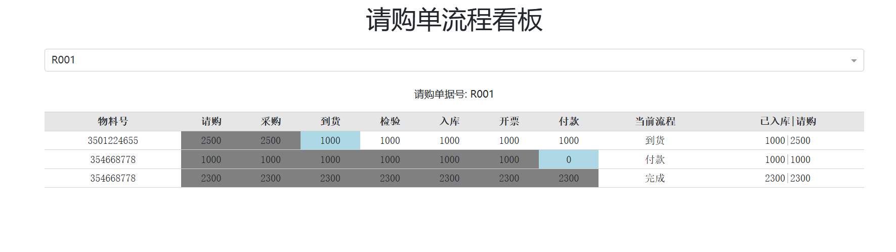

# 采购物料流程看板

## 实施方案

### ERP的采购请购单支持关联单据查询
- **基础数据表**：构建基于单据号的数据表，包含字段：物料编号、数量、日期等。
- **每日数据同步**：通过RPA每日自动获取所有关联单据，并对比新增的记录。
- **关联订单详情获取**：对于新增的关联单据，通过ERP系统的查询页面获取详细的订单信息。

### 关联订单种类
- **采购订单**
- **到货单**
- **来料检验单**
- **采购入库单**
- **采购发票**
- **付款申请单**

这些单据将按照以下流程进行跟踪：
1. 采购
2. 到货
3. 检验
4. 入库
5. 开票
6. 付款

### 示例
- **案例**：以05-08 PMC 物料分解采购请购单（PR240500001）为例。
- **更新记录**：从05-08至今已更新748条关联单据。
- **物料看板**：通过监控PR240500001来实现物料看板功能。
- **数据同步**：RPA日均下载8张表格并上传至数据库，预计每次更新所需时间为8分钟。

## 使用说明
1. **配置RPA**：确保RPA能够正确登录ERP系统并执行数据抓取任务。
2. **数据表维护**：定期检查并更新基础数据表中的字段信息。
3. **异常处理**：设置异常处理机制以应对数据抓取过程中的错误或异常情况。
4. **数据验证**：定期验证RPA抓取的数据准确性及完整性。

## 技术栈
- **RPA工具**：影刀
- **数据库**：MySQL
- **数据展示**：python、Dash

